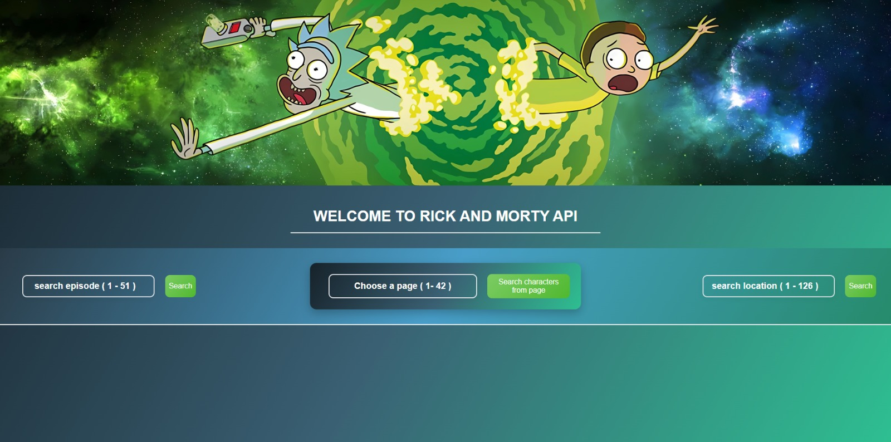
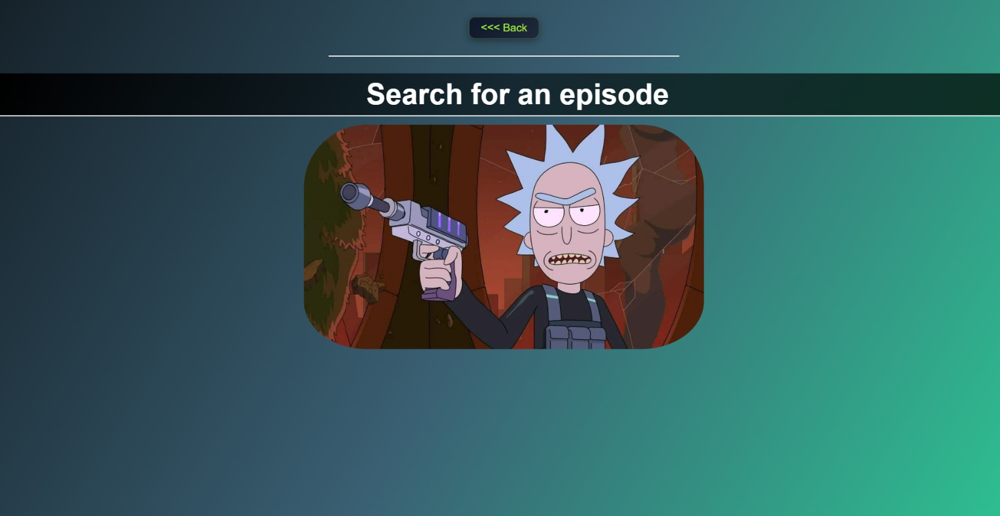
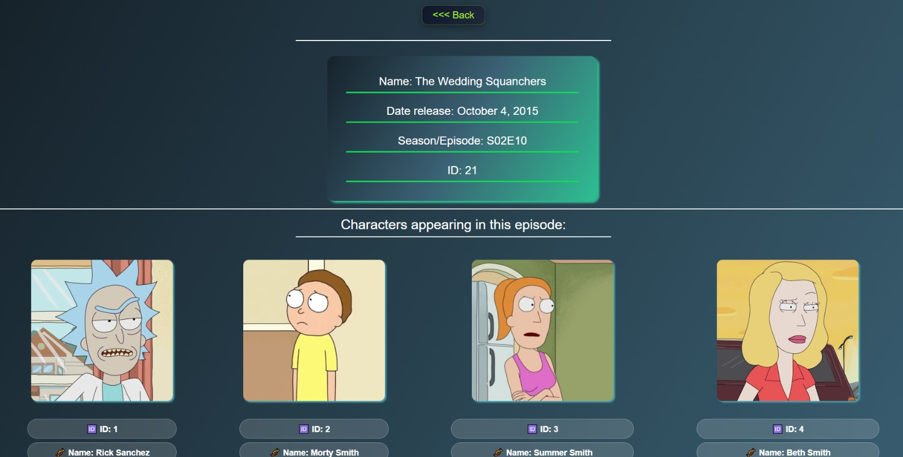
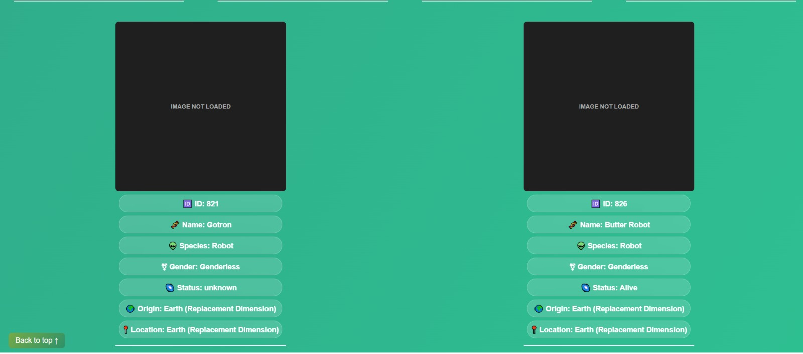
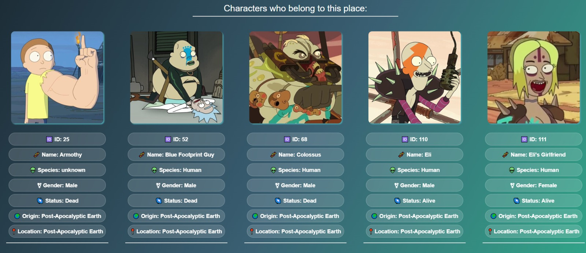
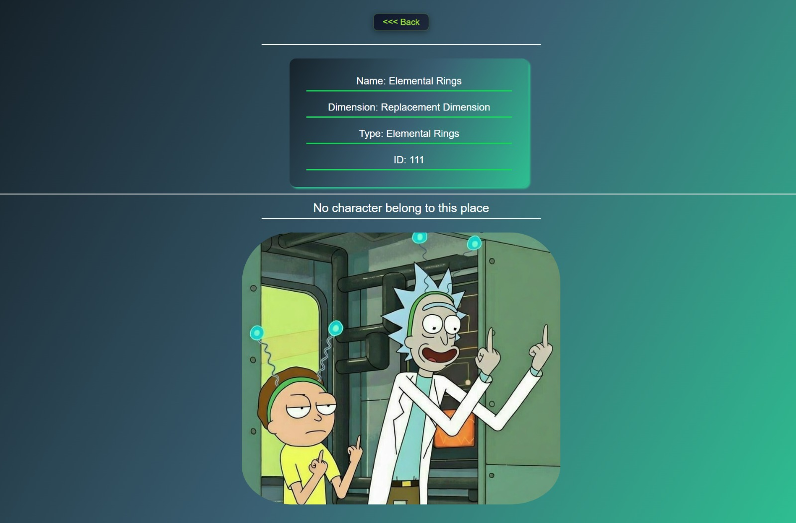
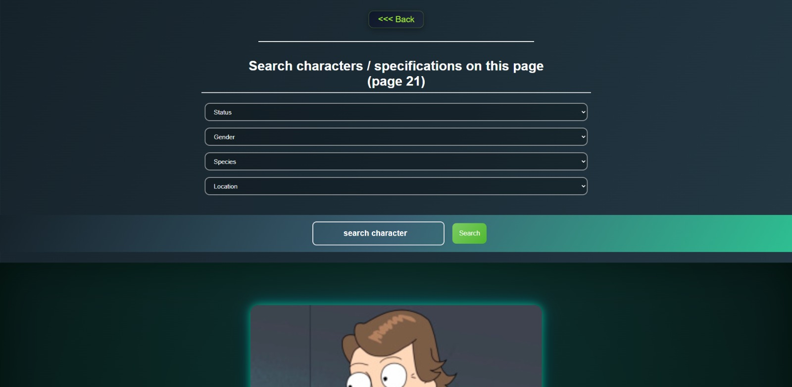
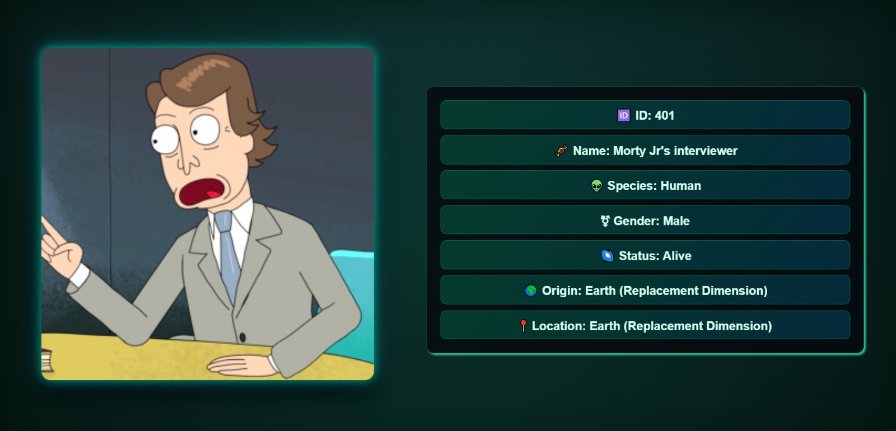

# 🛸 Rick and Morty Explorer

  
  

Aplicação web que consome a API pública da série **Rick and Morty**, permitindo explorar episódios, personagens e localizações do universo da série.

O sistema oferece múltiplas formas de busca e filtragem de dados, além de tratamento completo de erros e feedback visual para melhorar a experiência do usuário.

---

## 🌍 Sobre o projeto

Este projeto foi desenvolvido com foco em consumo de API e experiência do usuário, permitindo navegar por diferentes partes do universo da série de forma dinâmica.

A aplicação simula um ambiente real de consulta de dados, com **buscas inteligentes, filtros e tratamento de estados da interface**.

---

## 🖼️ Preview

<div align="center">
  
  
</div>

<div align="center">
  
  
</div>


<div align="center">
  
  
</div>


<div align="center">
  
  
</div>

---

## 🚀 Funcionalidades

### 🔎 Busca por Episódios

O usuário pode pesquisar um episódio pelo **ID** e visualizar:

* 🆔 ID do episódio
* 📺 Nome do episódio
* 📅 Data de lançamento
* 🎬 Temporada / Episódio
* 👥 Personagens que aparecem no episódio

Cada personagem exibido mostra:

* 🆔 ID
* 🧬 Nome
* 👽 Espécie
* ⚧ Gênero
* 🌌 Status
* 🌍 Origem
* 📍 Localização atual
* 🖼 Imagem do personagem

---

### 👥 Exploração por Página

Permite visualizar os personagens de uma **página específica da API**.

Também é possível:

* Selecionar um personagem específico da lista pelo **número**
* Filtrar personagens por:

  * Status
  * Gênero
  * Espécie
  * Localização

Os resultados são exibidos dinamicamente com base nos filtros selecionados.

---

### 🌍 Busca por Localizações

O usuário pode pesquisar uma localização e visualizar:

* 🆔 ID
* 📍 Nome da localização
* 🌌 Dimensão
* 🧪 Tipo de local

Além disso, o sistema lista **todos os personagens que pertencem àquele local**.

Caso nenhum personagem esteja associado, o sistema informa que **ninguém vive naquela localização**.

---

## ⚙️ Funcionalidades Extras

O projeto também inclui diversos tratamentos de interface e erro:

* ⏳ **Loading indicator** enquanto a API está sendo consultada
* ❌ **Mensagens de erro** para requisições inválidas
* 🧭 **Botão "voltar ao topo"** quando há muito conteúdo na tela
* 🖼 **Fallback de imagem** quando uma imagem de personagem falha
* 🔍 **Mensagens amigáveis quando não há pesquisa**
* 🚫 **Tela de "Not Found"** para:

  * Episódios inexistentes
  * Localizações inexistentes
  * Páginas inexistentes

Quando o usuário não digita nada nos campos de busca, o sistema exibe uma **imagem do Rick incentivando o usuário a realizar uma pesquisa**.

---

## 🧠 Tecnologias Utilizadas

* **HTML5**
* **CSS3**
* **JavaScript (Vanilla JS)**
* **Rick and Morty API**

---

## 🌐 API Utilizada

Rick and Morty API:  
https://rickandmortyapi.com/

A API fornece informações completas sobre:

* Personagens
* Episódios
* Localizações

---

## 🌐 Deploy

Acesse o projeto online:  
👉 https://api-rick-morty.vercel.app/

---

## 🌎 Idioma do Projeto

Todo o projeto foi desenvolvido **100% em inglês**, incluindo:

* nomes de variáveis
* estrutura do código
* mensagens exibidas na interface

---

## 🎯 Objetivo do Projeto

Este projeto foi desenvolvido para praticar:

* Consumo de **APIs REST**
* Manipulação do **DOM**
* Tratamento de **erros de requisição**
* **Filtros e buscas dinâmicas**
* Organização de lógica em **JavaScript**
* Melhoria de **UX (User Experience)**

---

Projeto criado com foco em aprendizado e evolução no desenvolvimento front-end.

---

## ▶️ Como rodar o projeto

```bash
# Clone o repositório
git clone https://github.com/gabrieldev25789/api-rick-morty.git

# Acesse a pasta
cd api-rick-morty

# Abra no navegador
index.html